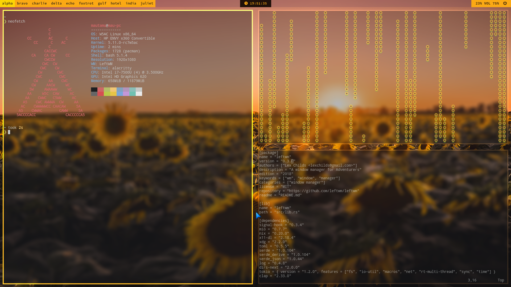

# Sunflower

## Screenshot



## Dependencies

- [leftwm](https://github.com/leftwm/leftwm)
- [leftwm-theme](https://github.com/leftwm/leftwm-theme)
- [rofi](https://github.com/davatorium/rofi)
- [picom](https://github.com/yshui/picom)
- [polybar](https://github.com/polybar/polybar)
- [font awesome(free)](https://github.com/FortAwesome/Font-Awesome)
- [source code pro font](https://github.com/adobe-fonts/source-code-pro)

## Installation

1. Install all required dependencies (required font ttf files can be added in ~/.fonts/)
2. Use leftwm-theme to install this theme.

```BASH
leftwm-theme update ;
leftwm-theme install sunflower
```

3. Set this as your current theme

```BASH
leftwm-theme apply sunflower
```

## Credits

This theme is based off of the excellent [Orange Forest](https://github.com/PVautour/leftwm-theme-orange-forest/) theme by [PVautour](https://github.com/PVautour). 
The ROFI configuration is based off of the [Glorious Dotfiles](https://github.com/manilarome/the-glorious-dotfiles) by [manilarome](https://github.com/manilarome/)
This work is based off the excellent i3 theme collection from [Stavros Grigoriou (unix121)](https://github.com/unix121)
